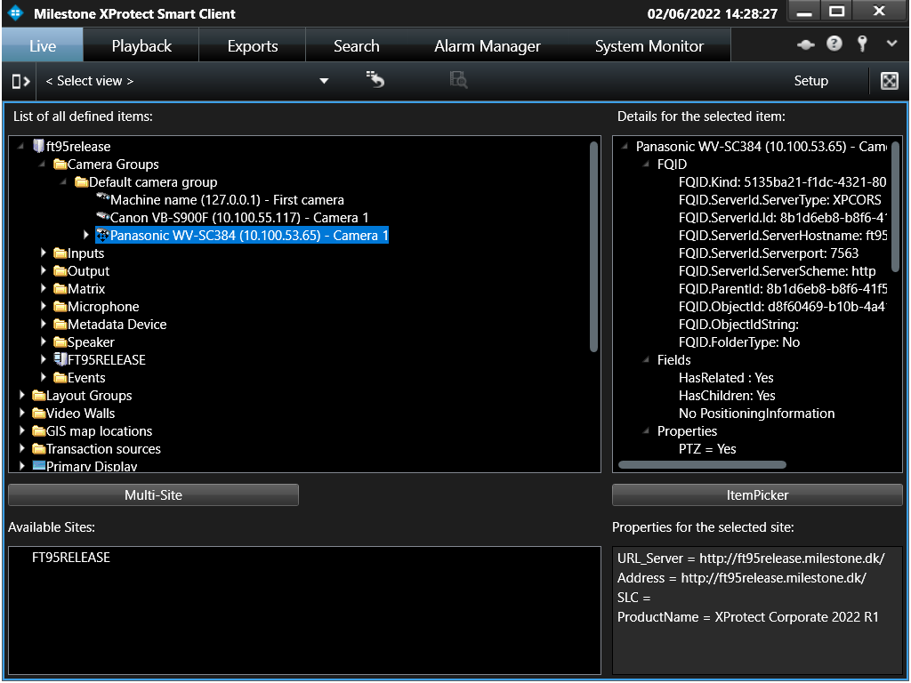
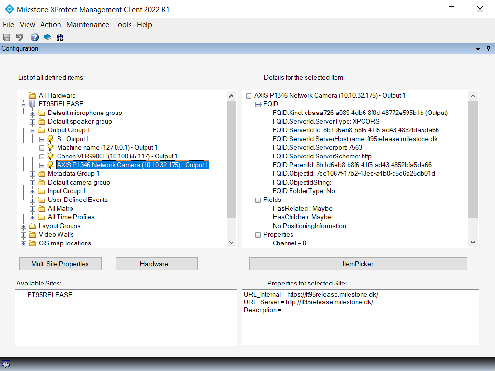

# Configuration Dump

The ConfigDump sample can be used for all MIP environments, and will
dump the configuration as it sees it.

## MIP Environment - Smart Client

In the Smart Client, it populates a tree view with the entire
configuration. Each time the user expands a node, the plug-in asks for
the child nodes and populates the child nodes with the result. Also,
when a node is selected, the node properties are displayed in the
upper-right corner of the window.

The upper half of the window illustrates all the available top nodes,
including all plug-ins, server side configurations, and Smart Client
items. The selection nodes can be expanded and collapsed.

The lower half of the window shows if multiple sites in a Milestone
Federated Architecture (MFA) setup is available and properties for each
site.

The ItemPicker button showcases that instead of building a treeview yourself
the ItemPickerWpfWindow can be used.

## MIP Environment - Management Client

When placed in the Management Client, the properties for each item
is filled with a lot of configuration settings, like IP address of the
cameras, the database information, and information about capabilities.
At the bottom, a site map is displayed.

When configuring an XProtect VMS in a federated architecture, each site
is configured separately and can be selected on the left hand side of
the Management Client. The configuration dump tool will dump items
configured on the currently selected site. At the top of the panel, all
sites are listed, and by clicking on these, the properties for each site
is displayed in the right pane.

The Hardware button showcases that it is possible to get Hardware items
within the Management Client, but Group Hierarchy must be disabled.
The reason is that groups do not exist for hardware.

The ItemPicker button showcases that instead of building a treeview yourself
the ItemPickerWpfWindow can be used.

## MIP Environment - Event Server

When this plug-in is loaded in the Event Server MIP environment, the
background plug-in is started and will dump the configuration to the log
file as well as write to Debug.WriteLine.
It also demonstrates how to make use of a thread to have code execute in the background.

## The sample demonstrates

- How to get configuration items from the MIP environment
- What properties exist for each item in the MIP environment
- How to use a thread to execute actions in the Event Server

## Using

- VideoOS.Platform.Configuration
- VideoOS.Platform.UI.ItemPickerUserControl
- VideoOS.Platform.Messaging

## Environment

- MIP environment for Smart Client
- MIP environment for XProtect Management Client
- MIP environment for the Event Server

## Visual Studio C\# project

- [ConfigDump.csproj](javascript:clone('https://github.com/milestonesys/mipsdk-samples-plugin','src/PluginSamples.sln');)
